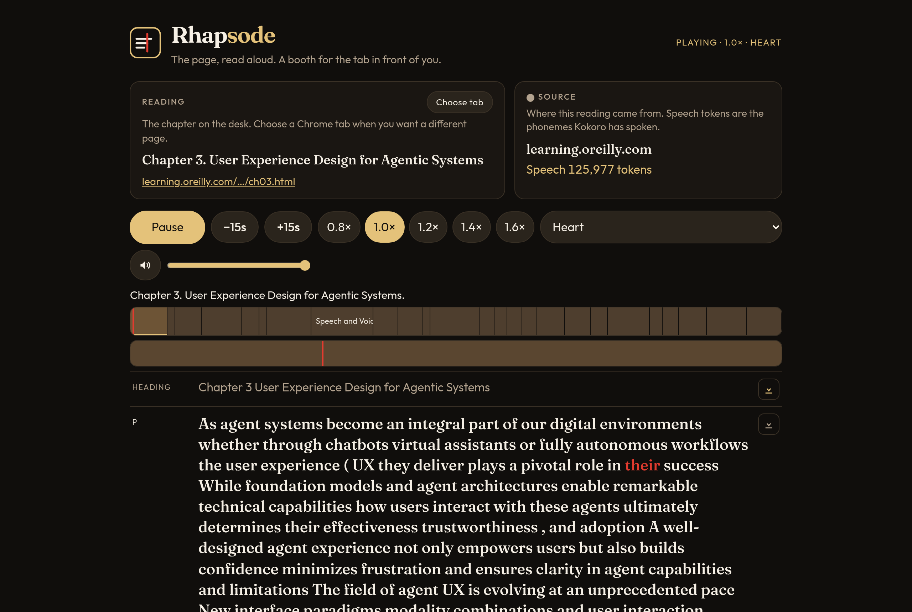

# Rhapsode

MIT License — Copyright 2026 Chris Piekarski


```
+----------------------------------------------------------+
|                                                          |
|  #####  #   #   ###   #####   ####   ###   ####   #####  |
|  #   #  #   #  #   #  #   #  #      #   #  #   #  #      |
|  #####  #####  #####  #####   ###   #   #  #   #  ####   |
|  #  #   #   #  #   #  #          #  #   #  #   #  #      |
|  #   #  #   #  #   #  #      ####    ###   ####   #####  |
|                                                          |
|  the page, read aloud                                    |
|                                                          |
|          ----------|---------------                      |
|      --------------+---------------------------          |
|              ------|---------------------                |
|                                                          |
+----------------------------------------------------------+
```

Rhapsode is a local booth. It reads an open web page or a saved document aloud with Kokoro, keeps your place, and can proofread the recording and bind it into an audiobook with chapters.

Open the booth with `rhapsode live` on a saved page, then choose another Chrome tab from the page itself. Speed, voice, and the playhead stay on this machine. Kokoro speaks. Whisper can listen back. ffmpeg binds the chapters.

The name is a job. A rhapsode stitched songs together and spoke them. The long version, and two diagrams, is [About](docs/about.md). The booth keeps the same note behind About.



## Install

Python 3.10 or newer, and `ffmpeg` on your PATH. The first time Rhapsode speaks, it downloads the Kokoro weights. A CUDA GPU is used when PyTorch can see one. Otherwise speech runs on the CPU.

```bash
python3 -m venv .venv
.venv/bin/pip install -U pip
.venv/bin/pip install -e ".[dev]"
ffmpeg -version
.venv/bin/rhapsode --version
```

On Windows, create the environment with `py -3 -m venv .venv` and call `.venv\Scripts\pip` and `.venv\Scripts\rhapsode`.

`[dev]` adds pytest, ruff, mypy, and the wheel builder. For the program alone, use `pip install -e .`.

Open a page you already saved:

```bash
.venv/bin/rhapsode live page.json
```

The booth is at <http://127.0.0.1:8765/>. **Choose tab** needs Google Chrome left open, and Node.js, so the booth can ask Chrome which tabs are open. A document you already have does not need them. What the page does is in [docs/desk-protocol.md](docs/desk-protocol.md).

### A wheel, for later

This builds a file you can upload to PyPI. It does not upload it.

```bash
.venv/bin/python -m build
```

`dist/` then holds `rhapsode-0.0.1-py3-none-any.whl` and a `.tar.gz`. `make wheel` is the same command. The wheel includes the booth page, the icon, the page extractor, and the lexicon.

To try that file on this machine, without uploading it:

```bash
.venv/bin/pip install dist/rhapsode-0.0.1-py3-none-any.whl
```

## Quick start

```bash
# Show the script without generating audio
rhapsode run my-page.json --dry

# Narrate a single document
rhapsode narrate my-page.json --voice af_bella --speed 1.2

# Full pipeline: narrate → proofread → encode with chapters
rhapsode run my-page.json

# Skip proofreading
rhapsode run my-page.json --no-proofread
```

```bash
# Stage files into inbox/ for batch processing
rhapsode inbox page1.json page2.json

# Proofread a WAV produced by narrate
rhapsode proof output.wav timings.json my-page.json

# Encode WAV → M4B with chapter markers
rhapsode bind output.wav my-page.json
```

## Architecture

```
document.json  ──build_script()──▶  utterances []
utterances         ──Narrator──▶    WAV (lexicon applied per-utterance, speech cache: 200 MB default)
WAV + script       ──proofread()──▶  ProofReport (WER + findings)
WAV + metadata     ──encode()──▶     M4B/MP3 (with chapter markers)
```

### Modules

| module | job |
|--------|-----|
| `document.py` | Parse JSON/Markdown/text into `Document`, split into `Utterance`s |
| `narrate.py` | Kokoro-82M TTS — render each utterance, write timed WAV |
| `cache.py` | Speech cache — 200 MB SQLite + NumPy disk cache for Kokoro synthesis |
| `speech.py` | Text cleaning + pronunciation `Lexicon` (applied per-utterance before TTS) |
| `proof.py` | faster-whisper transcribe-back + word-level alignment |
| `bind.py` | ffmpeg M4B/MP3 encoding with FFmpeg metadata chapters |
| `paths.py` | Output/inbox/whisper-dir paths, WSL path interop, slugify |
| `cuda.py` | CUDA 12 library preloading |

### Pipeline flow

1. **`load(path)`** — Parse a document (JSON from extractor, Markdown, or plain text)
2. **`build_script(doc)`** — Split into `Utterance`s (text, kind, section, pause)
3. **`Narrator().narrate(script, wav_path, Lexicon())`** — Speak each utterance, apply lexicon, write WAV with timings (cached via `SpeechCache`)
4. **`proofread(wav, script, timings)`** — Transcribe-back with whisper, compute WER and findings
5. **`encode(wav, out, ffmetadata(...chapters...))`** — Encode with chapter markers

### Dependencies

```
kokoro          # Kokoro-82M TTS. Brings in PyTorch
faster-whisper  # transcription for proofreading
soundfile       # audio I/O
numpy           # audio arrays
num2words       # number → word spelling
typer           # the rhapsode command
mcp             # Chrome tab reading, and the agent server
```

`ffmpeg` is a separate program. It is not installed by pip.

## Document format

Documents are JSON with a top-level title and sections. Each section has a heading, level, and blocks:

```json
{
  "title": "My Page",
  "url": "https://example.com/page",
  "site": "example",
  "lang": "en",
  "sections": [
    {
      "heading": "Introduction",
      "level": 1,
      "blocks": [
        { "kind": "p", "text": "Full text of section one…" },
        { "kind": "heading", "text": "Subheading" }
      ]
    }
  ]
}
```

Block kinds: `heading`, `p`, `li`, `quote`, `code`, `table`.

`extract.js` (run via Chrome DevTools MCP / DevTools) produces this format from browser content.

Plain text and Markdown files are auto-converted on load:

```bash
rhapsode run article.md      # Markdown headings become section boundaries
rhapsode run notes.txt       # plain text → single paragraph
```

### Voices

Voice IDs are from the Kokoro-82M model — see [hexgrad/Kokoro-82M](https://huggingface.co/hexgrad/Kokoro-82M). The first letter selects the language pipeline:

| prefix | language |
|--------|----------|
| `a` | American English |
| `b` | British English |
| `e` | Spanish |
| `f` | French |
| `h` | Hindi |
| `i` | Italian |
| `j` | Japanese |
| `p` | Portuguese |
| `z` | Mandarin |

Common voices: `af_heart` (American, default), `bf_emma` (British), `ef_dora` (Spanish), `ff_siwis` (French), `if_alla` (Italian), `hf_english` (Hindi).

### Lexicon

Pronunciation overrides live in `lexicon.txt` within the package (built-in) and can be extended via `~/.config/rhapsode/lexicon.txt`. Format:

```
# Rhapsode pronunciation lexicon
google = GOOGəl
x-ray  = /[ks ray]/    # phoneme pin via misaki syntax
```

Lexicon is applied **per-utterance before TTS rendering**, so the output audio already reflects the substitutions.

## Versioning

Releases follow [Semantic Versioning 2.0.0](https://semver.org/spec/v2.0.0.html). The version in `pyproject.toml` is the only copy of the number. `rhapsode --version` prints it.

The first public revision is `0.0.1`. Publish it by tagging that commit `v0.0.1`. The tag name is the version with a `v` prefix, and the two must match.

While the major version is 0, the public API is not stable. Patch numbers (`0.0.2`) are fixes. Minor numbers (`0.1.0`) may add or change behavior. `1.0.0` is the first stable API.

## Notes

- **Built with π**: Grok 4.7 arbitrated π, the local coding agent. π ran Ollama `qwen3.6:27b` with a 65,536-token context window, on this machine's Blackwell GPU (NVIDIA GeForce RTX 5090, 32 GB of GPU RAM). The run used 64 GB of system RAM and 51 million edge tokens.
- **WSL2**: `cuda.py.preload_cuda()` handles CUDA 12 lib paths. `output_dir()` and `inbox_dir()` default to Windows-side paths (`~/Music/Rhapsode`, `~/AppData/Local/Temp/rhapsode`) for cross-OS access. Set `RHAPSODE_OUT` / `RHAPSODE_INBOX` to override.
- **Pause between utterances**: auto-assigned per kind (`heading`: 0.7s, `p`: 0.5s, `li`: 0.3s, `quote`: 0.6s, `code`: 0.6s, `table`: 0.35s). Extra 0.8s gap between sections.
- **Whisper models**: Reuses models from `~/voxium/models` when present. Set `RHAPSODE_WHISPER_DIR` to override.
- **Output directory**: Default `~/.cache/rhapsode/<slug>` for work files, `Music/Rhapsode` for final audio. Set `RHAPSODE_OUT` to customize.
