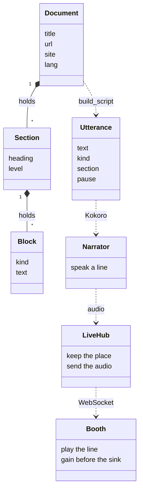
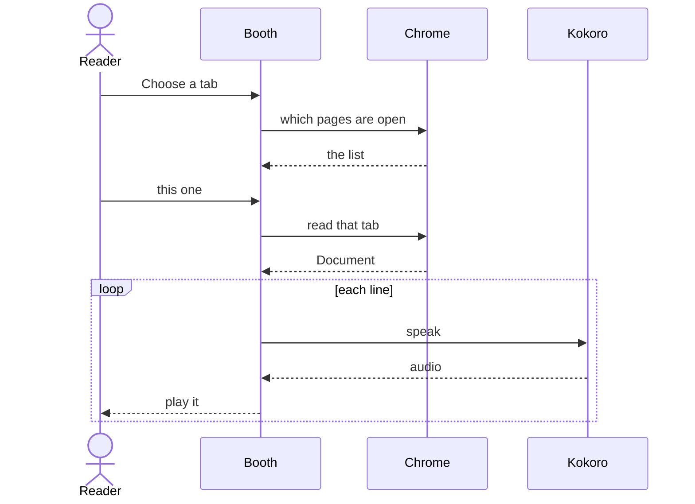

# About the name

A rhapsode was the person you sent for when a poem had to stand up and talk.

The Greek is ῥαψῳδός, *rhapsōidos*. It is two words stitched into one. ῥάπτειν, *rháptein*, means to sew. ᾠδή, *ōidē*, means a song. A song-stitcher. Not the poet. Not the page. The performer who takes pieces that already exist and makes them one long thing, in a voice, in a room, without losing the place.

That was a trade. In classical Greece a rhapsode learned Homer and the other epics, walked into a festival, and recited. The Iliad is not one scene. It is a pile of scenes. The art was the seam: which episode follows, where the voice rests, how the story stays whole for someone who cannot see the manuscript. Plato wrote a whole dialogue, the *Ion*, about a rhapsode who can say the poems and cannot say why. The poems were the point. The performer was the instrument.

English later wandered off with the word. A rhapsody became a rush of feeling, then a piece of music. The job underneath stayed the same. Someone still has to carry the text into a voice and keep the parts in order.

That is this booth.

A web page is already a pile of pieces. A title, some sections, paragraphs, the occasional table. Rhapsode does not write them. It stitches them into speech. Kokoro is the voice. The booth is the room. The playhead is the finger on the line, so you can leave and come back to the same stitch. Mute turns the voice down and leaves that finger where it is. When the reading is worth keeping, the same seam becomes an audiobook: one file, with chapters, which is the old job written down. Proofreading is the rhapsode checking the recitation against the poem and flagging the lines where the voice drifted.

The name is a job description. The page, read aloud.

The module map, with every file named, is in [architecture.md](architecture.md). The two pictures here are the stitch itself.

## The pieces

A page becomes a `Document`. A document becomes lines. A line becomes sound.

## One reading

You pick a tab. Chrome hands over the page. Kokoro speaks the lines. The booth plays them, and the level is set before the sound leaves for a speaker, a cast, or whatever else is listening.

