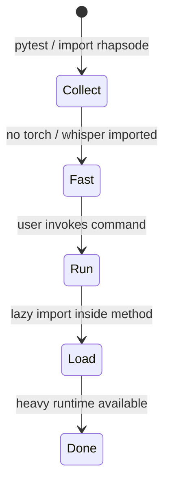
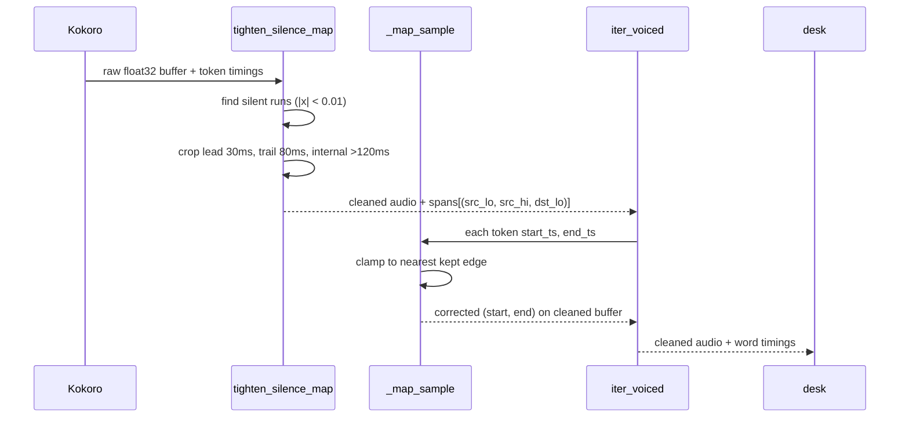
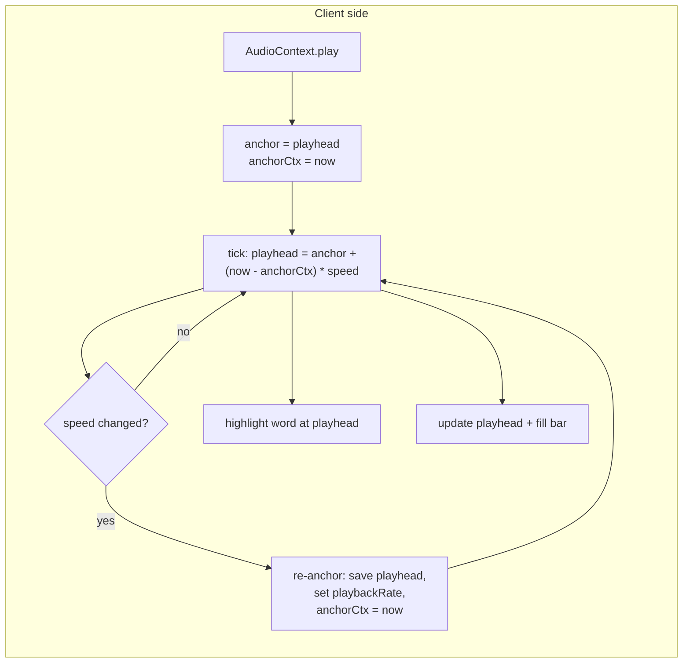
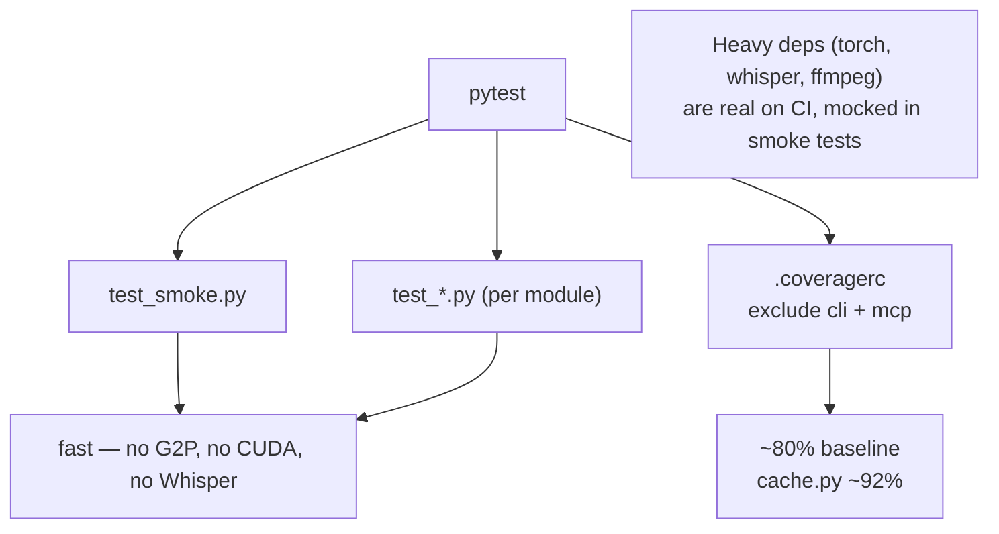

# Rhapsode Architecture

A pipeline that turns web pages and documents into narrated audiobooks, with a live operator desk for real-time playback.

## Module Map

```mermaid
graph TB
    CLI[cli.py<br/>typer commands] --> DOC[document.py<br/>Document / Section / Block / Utterance]
    CLI --> EXC[extractor.py<br/>extract_page]
    CLI --> SPA[speech.py<br/>Lexicon / clean_text]
    CLI --> NAR[narrate.py<br/>Narrator / PcmSpeaker]
    CLI --> PRF[proof.py<br/>ProofReport / proofread]
    CLI --> BIN[bind.py<br/>encode / ffmetadata]
    CLI --> DESK[desk.py<br/>LiveHub / serve_live]
    CLI --> AGT[agent.py<br/>MCP server / Booth]
    CLI --> PATHS[paths.py<br/>output / inbox / work]

    EXC --> MCP[mcp.py<br/>McpClient stdio]
    EXC --> JS[extract.js<br/>DOM → JSON]
    NAR --> CACHE[cache.py<br/>SpeechCache (SQLite + NumPy)]
    NAR --> CUDA[cuda.py<br/>preload_cuda12]
    PRF --> CUDA

    DESK --> HTML[operator.html<br/>AudioContext + seek]
    NAR --> HTML
    AGT --> DESK

    subgraph "TTS engine"
        KOK[(Kokoro-82M)]
        WHS[(faster-whisper)]
    end
    NAR --> KOK
    PRF --> WHS
```

## Narration Pipeline

Full data flow from source material to encoded audiobook with chapter markers.

```mermaid
flowchart LR
    A[URL / .md / .txt] --> E{source type}
    E -->|web page| B[extractor + MCP + extract.js]
    E -->|markdown| C[document.from_markdown]
    E -->|plain text| D[document.from_text]
    B --> B2["Document { title, sections, url, lang }"]
    C --> B2
    D --> B2
    B2 --> S[build_script → Utterance[]]
    S --> L[Lexicon.apply]
    L --> K[Narrator.iter_voiced]
    K --> C2{SpeechCache<br/>hit?}
    C2 -->|yes| A2[float32 PCM cached]
    C2 -->|no| KO[Kokoro inference → float32 PCM]
    KO --> SC[write cache (.npy)]
    A2 --> W["WAV (float32 → PCM_16)"]
    SC --> W
    K --> P{"live? "}
    P -->|yes| H[LiveHub → WebSocket → operator.html]
    P -->|no| W
    W --> PR[proofread: Whisper transcription + Levenshtein]
    PR --> R[ProofReport + lexicon fix]
    W --> EN[encode: ffmpeg + ffmetadata + chapters]
    EN --> O["m4b / mp3 / opus / ogg"]
```

### Pipeline Stages

| Stage | Module | Role |
|-------|--------|------|
| **Extract** | `extractor.py` + `mcp.py` + `extract.js` | Chrome DevTools → JSON document |
| **Parse** | `document.py` | JSON / Markdown / plain text → `Document` |
| **Script** | `document.py` | `build_script(Document)` → `Utterance[]` |
| **Lexicon** | `speech.py` | `Lexicon.apply()` — pronunciation overrides |
| **Synthesize** | `narrate.py` | Kokoro inference → float32 PCM pieces |
| **Tighten** | `narrate.py` | Silences cropped: 30 ms lead, 80 ms trail, 30 ms internal edge |
| **Proofread** | `proof.py` | Whisper transcription + word-level Levenshtein → `ProofReport` |
| **Encode** | `bind.py` | ffmpeg with FFMETADATA1 chapter markers → m4b/mp3/opus |
| **Live Booth** | `desk.py` + `operator.html` | WebSocket booth: play, speed, seek, volume, section chart, Choose tab. See [desk-protocol.md](desk-protocol.md) |

## Design-Pattern Diagrams

### Lazy Import (CUDA / MCP)

Heavy dependencies (`torch`, `faster_whisper`, `mcp`) are gated behind functions so test collection and type-checking never import them.



### Silence-Mapping (word-timing correction)

`tighten_silence_map` returns contiguous kept-region spans. `_map_sample` clamps positions in deleted silence to the nearest kept edge, so word boundaries always land on voicible audio.



### Seek-Anchoring (live desk)

Absolute playhead position is tracked via anchor/speed arithmetic on `AudioContext.currentTime`, re-anchoring on speed change.



## Directory Structure

```
src/rhapsode/
├── __init__.py        # public API surface
├── agent.py           # Rhapsode MCP server (serve / Booth / interpret_command)
├── bind.py            # ffmpeg encode + FFMETADATA1 chapters
├── cache.py           # SpeechCache — SQLite + NumPy disk cache (no Kokoro imports)
├── cli.py             # typer commands: narrate, proof, bind, run, inbox, read, live, play, agent
├── cuda.py            # preload CUDA 12 libs for CTranslate2
├── desk.py            # HTTP + WebSocket live hub (LiveHub, _Handler, serve_live)
├── document.py        # Document / Section / Block / Utterance models + parsers
├── extract.js         # runs in Chrome via MCP — reads DOM → JSON
├── extractor.py       # orchestrate MCP page open + evaluate + save
├── lexicon.txt        # built-in pronunciation overrides
├── mcp.py             # stdio-backed MCP client for chrome-devtools-mcp (McpClient)
├── narrate.py         # Kokoro inference + silence tightening + PcmSpeaker
├── operator.html      # live listening booth (AudioContext + seek + highlight)
├── paths.py           # output/inbox/work directories, WSL path translation, speech_cache_dir
├── proof.py           # Whisper-based proofreading + word-level alignment
└── speech.py          # clean_text, sentence, Lexicon

tests/
├── test_bind.py
├── test_cli.py
├── test_cuda.py
├── test_desk_cover.py
├── test_document.py
├── test_extract.py
├── test_narrate.py
├── test_paths.py
├── test_proof.py
├── test_speech_cache.py   # SpeechCache unit tests (cache isolation: cache=False)
├── test_smoke.py
└── test_speech.py

docs/
├── architecture.md    ← you are here
├── desk-protocol.md   ← HTTP + WebSocket API
└── mcp-api.md         ← Chrome DevTools MCP client + Rhapsode MCP server
```

## Testing Strategy



- **Smoke tests** run without `torch`, `faster_whisper`, or `ffmpeg` — using `patch.dict("sys.modules", ...)` stubs.
- **Unit tests** target every module (`test_document.py`, `test_narrate.py`, etc.) with mocked inference.
- **Speech cache tests** — `test_speech_cache.py` (17 tests) validates `SpeechCache`, `load_or_render`, `origin_for`, LRU eviction, and schema migration. All `Narrator` instantiations pass `cache=False` to isolate mocks from the real disk cache.
- **Coverage** is configured via `.coveragerc` (not `pyproject.toml`) to avoid `pytest_cov` TOML parser conflicts. `cli.py` and `mcp.py` are excluded because their imports are runtime-gated.
