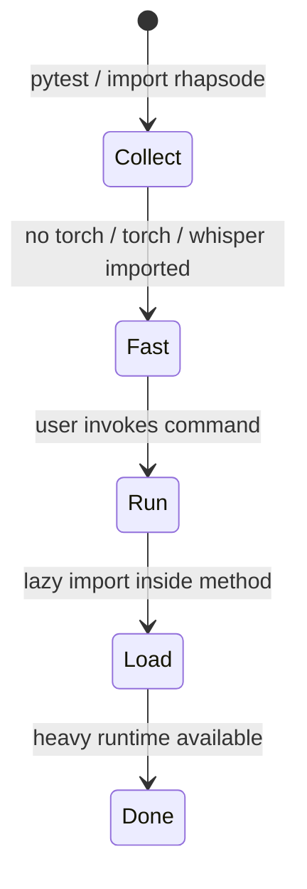
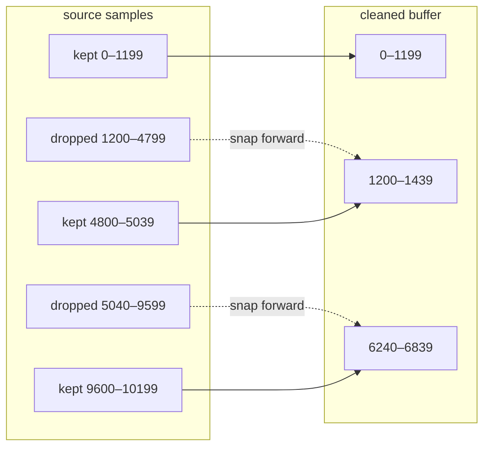
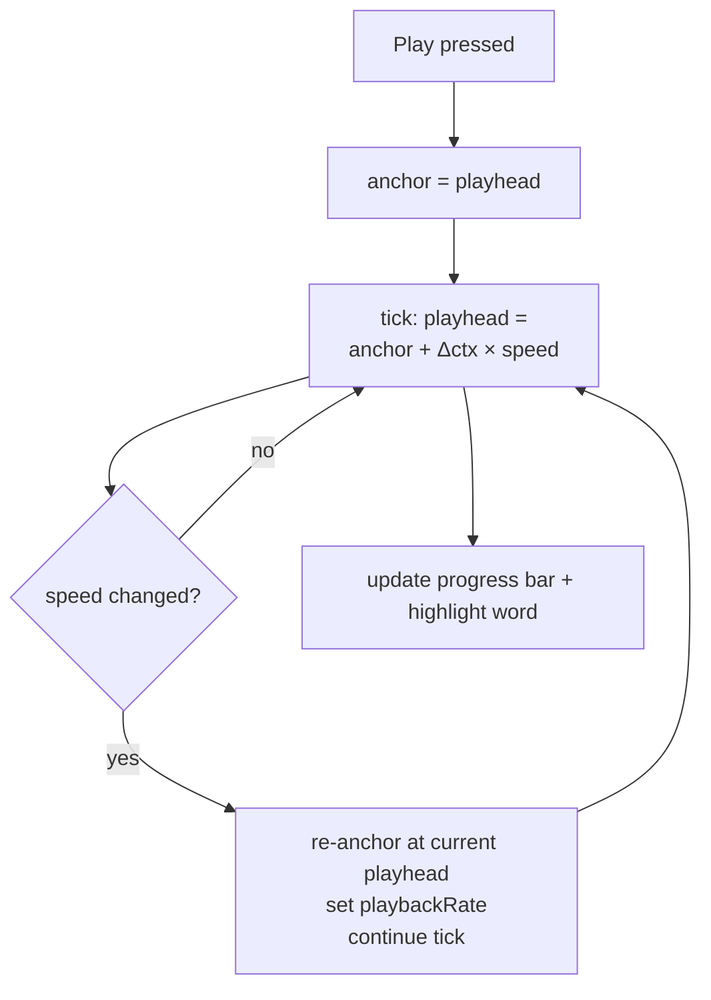
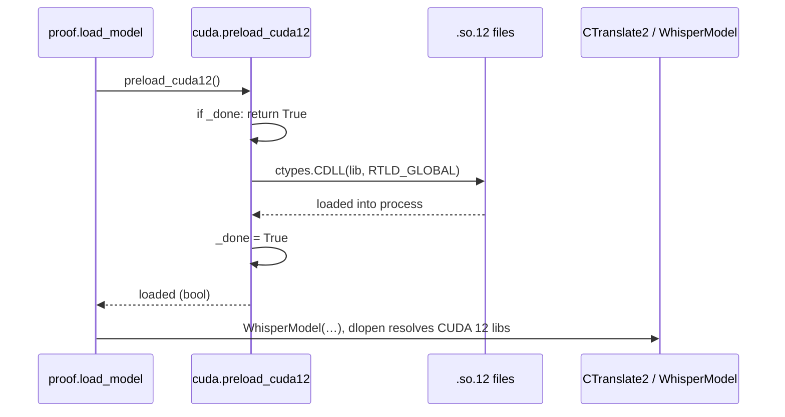

# Design Patterns

Catalog of the patterns used across the Rhapsode codebase.

## 1. Lazy Import

Heavy runtimes (`torch`, `faster_whisper`, `mcp`) are **never** imported at module level. They are pulled inside `__aenter__` or inside called methods so that `import rhapsode.*` and `pytest --collect-only` always succeed.

```python
# narrate.py — Narrator.__init__
def __init__(self, …) -> None:
    import torch                          # imported only when you construct a Narrator
    from kokoro import KModel, KPipeline

# proof.py — load_model
def load_model(name: str):
    from faster_whisper import WhisperModel  # imported only at proof time

# mcp.py — McpClient.__aenter__
async def __aenter__(self) -> "McpClient":
    from mcp import ClientSession              # imported only on MCP connect
```

**Why**: The `mcp` package carries pydantic models that crash on import with newer pydantic versions. `torch` and `faster_whisper` each pull gigabytes of CUDA libraries. Lazy loading means test collection, CLI help, and the web server start instantly.



**Test pattern**: `patch.dict("sys.modules", {"torch": None, "faster_whisper": None})` stubs them out in test modules.

---

## 2. Silent-Audio Span Mapping

Kokoro produces per-utterance PCM with silent padding. `tighten_silence_map()` removes interior gaps but preserves a word-to-samplable mapping so the live desk can still highlight words accurately.

```python
# Tighten returns (cleaned_audio, spans)
spans = [
    (0, 1200, 0),           # keep samples 0–1199 at dest 0
    (4800, 5040, 1200),    # keep 4800–5039 at dest 1200
    (9600, 10200, 6240),   # keep 9600–10199 at dest 6240
]
```

`_map_sample(spans, raw_pos, n)` clamps a raw Kokoro timestamp into the cleaned buffer. Positions inside deleted regions snap forward to the start of the next kept span.



### Edge Preservation

| Region | Rule |
|--------|------|
| Leading silence | Keep 30 ms, crop rest |
| Trailing silence | Keep 80 ms, crop rest |
| Internal run > 120 ms | Keep 30 ms at each edge, crop middle |
| Internal run ≤ 120 ms | Keep entire run (fade already good) |

---

## 3. Seek-Anchoring with AudioContext

The live desk tracks absolute playback position without a real-time clock. All timestamps accumulate in 1.0× (real-time) seconds; the client converts via the current speed multiplier.

```ts
// On play:
anchor = currentPlayhead;
anchorCtx = audioCtx.currentTime;

// Each tick (requestAnimationFrame):
playhead = anchor + (audioCtx.currentTime - anchorCtx) * speed;

// On speed change:
playhead = anchor + (audioCtx.currentTime - anchorCtx) * oldSpeed;
audioCtx.playbackRate = newSpeed;
anchor = playhead;
anchorCtx = audioCtx.currentTime;
```



---

## 4. Tab Reuse via Normalized URLs

`extractor._find_or_create_page()` reduces redundant Chrome tab creation by comparing normalized URLs (hashes and trailing slashes stripped).

```python
def _normalize(url: str) -> str:
    parsed = urlparse(url)
    path = parsed.path.rstrip("/")
    return f"{parsed.scheme}://{parsed.netloc}{path}?{parsed.query}" if parsed.query
            else f"{parsed.scheme}://{parsed.netloc}{path}"
```

| Input | Normalized |
|-------|-----------|
| `https://example.com/page/#sec1` | `https://example.com/page` |
| `https://example.com/page/` | `https://example.com/page` |
| `https://example.com/page?q=1#top` | `https://example.com/page?q=1` |

---

## 5. Idempotent CUDA Preload

`cuda.preload_cuda12()` loads CUDA 12 `.so` files into the process with `ctypes.CDLL + RTLD_GLOBAL` before CTranslate2 (used by faster-whisper) tries `dlopen`. A module-level `_done` flag makes it truly idempotent.



---

## 6. Threaded Narration + Lock-Guarded Hub

Live narration runs in a daemon thread. `LiveHub` uses a single `threading.Lock` to guard the client list and the audio backlog. Publish writes to the backlog and fans out to all connected sockets simultaneously.

```mermaid
sequenceDiagram
    alias T1 = HTTP Thread<br/>(_Handler)
    alias T2 = Narration Thread<br/>(_narrate_into)
    alias H = LiveHub

    T2->>H: publish_audio(index, samples, start, end, words)
    crit lock: H._lock
        H->>H: append to self.audio
        H->>H: update line timings
    end
    H->>T1: _send_pair(meta, pcm)
    T1->>T1: sendall JSON + binary to all sockets
    T1->>H: dead sock → remove from list
```

---

## 6. Speech Cache (SQLite + NumPy)

`cache.SpeechCache` provides a 200 MB (default, configurable via `RHAPSODE_SPEECH_CACHE_MB`) disk cache for Kokoro TTS synthesis results. The module uses only stdlib + NumPy — **no Kokoro imports**.

```python
cache = SpeechCache(root=Path("~/.cache/rhapsode/speech"), budget_bytes=200 * 1024 * 1024)
```

**Key**: `cache_key(voice, speed, text, sample_rate, repo)` — SHA-256 of compact JSON. Speed rounded to 3 decimal places to handle float precision drift.

**Storage**: SQLite for metadata (`cache` table: `key`, `origin_id`, `size_bytes`, `used`; `origins` table: `page_url`, `page_title`, `section_index`, `section_heading`, `utterance_index`, `kind`, `tab_url`). Individual `.npy` blobs under `root/` for audio data.

**Atomic writes**: `.npy.tmp` → `.npy` via `os.replace`.

**Thread safety**: `threading.Lock` guards all DB and file operations.

**Eviction**: LRU by `used` timestamp. When `budget_bytes` exceeded, oldest entries are trimmed.

**`Narrator` behavior**: `cache=None` (default) → uses default disk cache. `cache=False` → disabled. In unit tests, always pass `cache=False` to isolate mocks.

**Migration**: `_migrate_origins` checks `sqlite_master` for the old schema without `tab_url`, drops and recreates the table, and copies rows.

---

## 7. Unified Document Model

Three input formats (extractor JSON, Markdown, plain text) all map into the same `Document → Section → Block` tree. `build_script()` then flattens them into `Utterance[]` for synthesis.

```mermaid
flowchart TD
    J[extract JSON] --> F[from_json]
    M[Markdown] --> FM[from_markdown]
    T[plain text] --> FT[from_text]
    F --> DOC["Document { title, sections[] }"]
    FM --> DOC
    FT --> DOC
    DOC --> BS[build_script → Utterance[]]
    BS --> LEX[Lexicon.apply]
    LEX --> KOK[Narrator.iter_pcm]
```

| Block kind | Pause (s) | Notes |
|-----------|-----------|-------|
| `heading` | 0.70 | + 0.80 section-gap after first heading |
| `p` | 0.50 | Default fallback |
| `li` | 0.30 | List items |
| `quote` | 0.60 | Block quotes |
| `code` | 0.60 | Announced as "Code sample skipped." (configurable) |
| `table` | 0.35 | Read row-by-row with label: value pairs |

---

## 8. FFMETADATA1 Chapter Encoding

`bind.ffmetadata()` writes an `.ffmeta` sidecar that ffmpeg reads for chapter markers. This is standard for `.m4b` audiobooks.

```
;FFMETADATA1
title=Chapter Title
artist=Rhapsode
genre=Speech
comment=URL or source

[CHAPTER]
TIMEBASE=1/1000
START=0
END=45000
title=Introduction

[CHAPTER]
TIMEBASE=1/1000
START=45000
END=120000
title=Main Content
```

`bind.encode()` pipes this through `ffmpeg -map_metadata 1 -map_chapters 1` with codec selection from `CODECS` (aac, mp3, opus, pcm_s16le).
