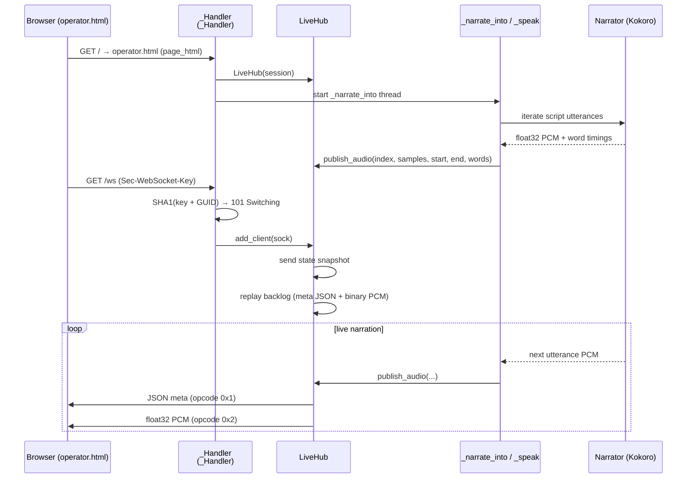
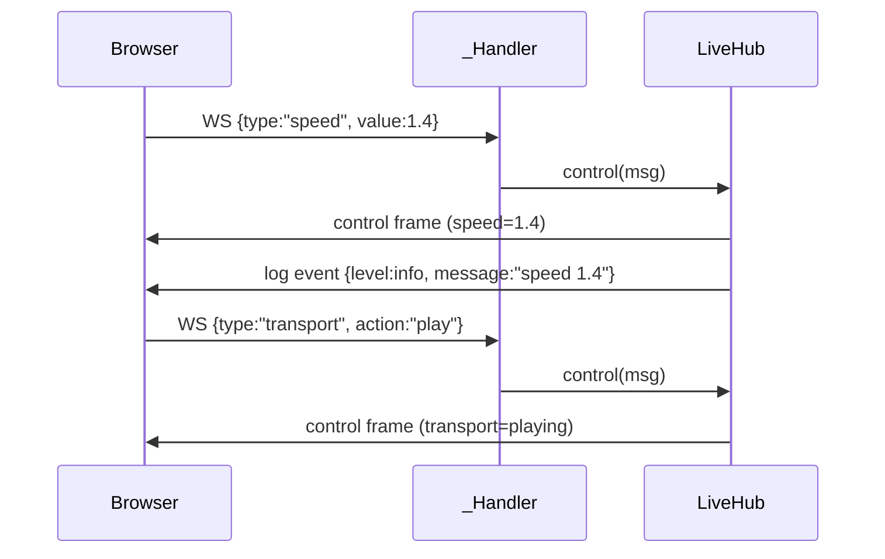
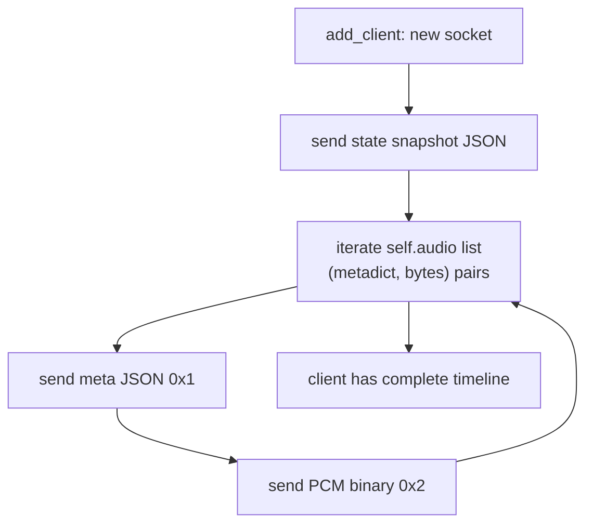

# Live Operator Desk — HTTP + WebSocket Protocol

The operator desk (`desk.py`) is a threaded HTTP server with WebSocket support. It serves the operator page (`operator.html`), pre-rendered WAV audio, and a live narration pipe that streams Kokoro PCM in real time with word-level timing for seek and highlight.

**Default address**: `http://127.0.0.1:8765` (the `--port` option on `rhapsode live` and `rhapsode play`).

## Using the booth

```bash
rhapsode live page.json
```

Open <http://127.0.0.1:8765/>. The page is one column.

**Reading.** The chapter title and a link to the page. **Choose tab** lists the open Chrome tabs and leaves the booth's own tab out. Pick one and that page replaces the reading. Chrome has to be open, with remote debugging available. If it is not, the booth says to turn it on at `chrome://inspect/#remote-debugging`.

**Source.** The site, or the host, the text came from, plus how many speech tokens Kokoro has spoken. In and out byte counts appear only while a Chrome DevTools connection is live. A saved file with no page address shows the file name.

**Controls.** Play and pause. Jump 15 seconds back or forward. Speed buttons from 0.8× to 1.6×. The voice. A volume slider and a mute button. Mute silences the reading and does not pause it. The level is applied in a GainNode before the sound leaves the tab, so a cast or another output device follows it. This browser remembers the level under `rhapsode.volume`.

**Place.** The section chart is above the position bar. Click a section to jump there. The red line is the playhead. The script highlights the word being spoken. Your place is kept on this machine and sent back to the booth.

**About.** The header link explains the name. Opening it does not change playback.

Reload the page after a change to `operator.html`. A change to the Python server needs the booth to be started again.

## Connection Flow



## HTTP Endpoints

All paths are handled by `_Handler` which delegates to `LiveHub`.

### `GET /` and `GET /index.html`

Serve the operator page HTML.

| | |
|---|---|
| **Method** | `GET` |
| **Path** | `/` or `/index.html` |
| **Response** | `200 OK` — `operator.html` content (from `page_html()`) |

### `GET /ws`

WebSocket upgrade. Streams live narration PCM + metadata to connected clients.

| | |
|---|---|
| **Method** | `GET` |
| **Path** | `/ws` |
| **Upgrade** | `101 Switching Protocols` |
| **Protocol** | Text frames: JSON metadata. Binary frames: float32 PCM samples. |

On connect, the server sends a complete state snapshot and replays the audio backlog.

### `GET /session`

Return the current session state.

| | |
|---|---|
| **Method** | `GET` |
| **Path** | `/session` |
| **Response** | `200 OK` — JSON from `LiveHub.snapshot()`, or, before the booth is live, the session the process was started with (`title`, `source`, `mcp`, `lines` only) |

```json
{
  "type": "state",
  "transport": "playing",
  "speed": 1.2,
  "voice": "af_heart",
  "title": "Chapter Title",
  "place": { "id": "https://example.com/article", "playhead": 45.3, "speed": 1.2, "at": 1710000000 },
  "speech_tokens": 1234,
  "generation": 1,
  "source": {
    "kind": "page",
    "label": "https://example.com/article",
    "identity": "example.com/article",
    "detail": "Chapter Title",
    "site": "Example"
  },
  "mcp": {
    "connected": false,
    "active": false,
    "instance": "No Chrome connection",
    "profile": "The text came from a file.",
    "account": "",
    "bytes_in": 0,
    "bytes_out": 0
  },
  "lines": [
    {
      "text": "First heading.",
      "kind": "heading",
      "start": 0.0,
      "end": 2.1,
      "status": "done",
      "words": [ { "text": "First", "start": 0.0, "end": 0.4 } ]
    }
  ]
}
```

`place` is null until this machine has saved one. `speech_tokens` counts phoneme tokens Kokoro has already spoken.

### `GET /voices`

List available Kokoro voices (English only, live desk scope).

| | |
|---|---|
| **Method** | `GET` |
| **Path** | `/voices` |
| **Response** | `200 OK` — `{"voices": [{"id": "af_heart", "name": "Heart", "accent": "American", "gender": "woman", "group": "American women", "label": "Heart · American woman"}, …]}` |

28 English voices: `af_alloy`, `af_aoede`, `af_bella`, `af_heart`, `af_jessica`, `af_kore`, `af_nicole`, `af_nova`, `af_river`, `af_sarah`, `af_sky`, `am_adam`, `am_echo`, `am_eric`, `am_fenrir`, `am_liam`, `am_michael`, `am_onyx`, `am_puck`, `am_santa`, `bf_alice`, `bf_emma`, `bf_isabella`, `bf_lily`, `bm_daniel`, `bm_fable`, `bm_george`, `bm_lewis`. Default: `af_heart`.

### `GET /tabs`

List open Chrome http(s) tabs by asking Chrome through `chrome-devtools-mcp`. This does not require `rhapsode live --mcp`. The booth page itself (`127.0.0.1:8765` and `localhost:8765`) is left out.

| | |
|---|---|
| **Method** | `GET` |
| **Path** | `/tabs` |
| **Response** | `200 OK` — `{"tabs": [{"id": 1, "url": "https://…", "title": "…"}, …]}`. `title` is omitted when Chrome has none. The booth's own page is left out. |
| **Error** | `409` when the booth is not live. `502` when Chrome cannot be listed. |

### `GET /export.wav`

Build a WAV from the lines already spoken. This is not the byte-range file at `/audio`.

| | |
|---|---|
| **Method** | `GET` |
| **Path** | `/export.wav?from=<line>&to=<line>&name=<filename>` |
| **Response** | `200 OK` — `audio/wav`, `Content-Disposition: attachment`, `X-Rhapsode-Lines: included/requested`. `X-Rhapsode-Partial: 1` when some requested lines have no audio yet. |
| **Error** | `409` when the booth is not live, or when the range has no audio. `400` when `from` or `to` is not an integer. |

`from` and `to` default to `0`. `name` defaults to `rhapsode.wav`. Characters outside letters, digits, `.`, `_`, and `-` become `-`, and the name is forced to end in `.wav`.

### `GET /audio`

Serve the booth's WAV file. Honors a `Range` header.

| | |
|---|---|
| **Method** | `GET` |
| **Path** | `/audio` |
| **Response** | `200 OK` for the whole file, or `206 Partial Content` with `Content-Range` for a valid byte range. |
| **Headers** | `Accept-Ranges: bytes`, `Content-Type: audio/wav` |
| **Error** | `416` when the `Range` header cannot be satisfied. |

### `POST /control`

Send a control command to the live hub.

| | |
|---|---|
| **Method** | `POST` |
| **Path** | `/control` |
| **Body** | JSON object with `type` field (see below) |
| **Response** | `200 OK` — `agent_view` of the booth |
| **Error** | `409` when the booth is not live. `400` when the body is missing, larger than 8192 bytes, not a JSON object, or `interpret_command` raises `ValueError`. |

**Command types**:

| `type` | Fields | Effect |
|--------|--------|--------|
| `transport` | `{ "action": "play" \| "pause" }` | Sets transport to `playing` or `paused`, then broadcasts a `control` frame and a log |
| `speed` | `{ "value": 1.2 }` | Sets playback speed. Allowed range is 0.5 to 2.0. A missing value keeps the current speed |
| `seek` | `{ "seconds": 45.0 }` | Jumps to that time on the 1.0× timeline. A negative time is 400 |
| `voice` | `{ "value": "bf_emma", "line": 5 }` | Switches voice from that line onward. The id must be one of the 28 English voices |

### `POST /tab`

Switch to a different Chrome tab for the next narration.

| | |
|---|---|
| **Method** | `POST` |
| **Path** | `/tab` |
| **Body** | JSON `{ "url": "https://example.com/next" }` — must start with `http` |
| **Response** | `200 OK` — `{"ok": true, "title": "…", "url": "https://example.com/next"}` |
| **Error** | `400` — `"Pick a tab by its http address."` when the URL does not start with `http`. `409` when the booth is not live. `502` when the tab cannot be read. The failure is also written to the booth log. |

### `GET /icon.svg`

Return the Rhapsode icon.

| | |
|---|---|
| **Method** | `GET` |
| **Path** | `/icon.svg` |
| **Response** | `200 OK` — `Content-Type: image/svg+xml` from the packaged `icon.svg` |
| **Error** | `404` — if `icon.svg` is missing |

## WebSocket Messages

### Server → Client

| `type` | Opcode | Source method | Fields |
|--------|--------|---------------|--------|
| `audio` | text (`0x1`) | `LiveHub.publish_audio` | `{"type":"audio","index": N, "start": S, "end": E, "words": [...], "generation": G}` |
| *(PCM)* | binary (`0x2`) | `LiveHub.publish_audio` | Raw little-endian float32 mono at 24 000 Hz |
| `state` | text (`0x1`) | `LiveHub.snapshot` (connect + state changes) | `{"type":"state"}` plus session fields: `title`, `source`, `lines`, `mcp` — and `speed`, `transport`, `voice`, `place`, `speech_tokens`, `generation` |
| `progress` | text (`0x1`) | `LiveHub.set_status` | `{"type":"progress","index": N, "status": S, "generation": G}` — status values: **`rendering`**, **`done`**, **`queued`** |
| `log` | text (`0x1`) | `LiveHub.event` | `{"type":"log","level": L, "message": "…"}` — levels used: **`info`**, **`error`**, **`warn`** |
| `control` | text (`0x1`) | `LiveHub.control` | `{"type":"control"}` plus the fields `interpret_command` returned (`transport`, `speed`, `seek`, or `voice` + `line`). A bad command does **not** send `control`; the WebSocket handler calls `event("warn", …)` instead. |
| `cut` | text (`0x1`) | `LiveHub.drop_from` | `{"type":"cut","from": <line index>,"generation": <int>}` |
| `speech` | text (`0x1`) | `LiveHub.add_speech_tokens` | `{"type":"speech","tokens": <running total>}` — total phoneme tokens Kokoro has already spoken |
| `mcp` | text (`0x1`) | `LiveHub.set_mcp` | `{"type":"mcp", ...}` — Chrome status fields, excluding any incoming `type` key |
| `document` | text (`0x1`) | `LiveHub.replace_document` | `{"type":"document"}` plus the full snapshot fields: session, `speed`, `transport`, `voice`, `place`, `speech_tokens`, and `generation` |

### State Snapshot (`state`)

Sent on every WebSocket connect (`LiveHub.add_client`) and returned by `GET /session`. It is the full dict from `LiveHub.snapshot()`:

```json
{
  "type": "state",
  "title": "Chapter Title",
  "source": {
    "kind": "page",
    "label": "https://example.com/article",
    "identity": "example.com/article",
    "detail": "Chapter Title",
    "site": "Example"
  },
  "lines": [
    {
      "text": "First heading.",
      "kind": "heading",
      "start": 0.0,
      "end": 2.1,
      "status": "pending",
      "words": [ {"text": "First", "start": 0.0, "end": 0.4} ]
    }
  ],
  "mcp": { ... },
  "speed": 1.0,
  "transport": "paused",
  "voice": "af_heart",
  "place": {"id": "https://example.com/article", "playhead": 45.3, "speed": 1.0, "at": 1710000000},
  "speech_tokens": 1234,
  "generation": 1
}
```

### Client → Server

The WebSocket handler (`_Handler._websocket`) reads opcodes. Opcode 8 closes the connection. Opcode 9 (ping) is answered with opcode 10 (pong). Any frame that is not opcode 1 (text) is ignored. Text frames are parsed as JSON and dispatched by `type`:

| `type` | Fields | Effect |
|--------|--------|--------|
| `place` | `{"playhead": S, "speed": S}` | Calls `LiveHub.remember_place(playhead, speed)` to save position |
| `speed` | `{"value": 1.2}` | Sent to `LiveHub.control(msg)` → sets speed, broadcasts state + log |
| `transport` | `{"action": "play" \| "pause"}` | Sent to `LiveHub.control(msg)` → sets transport, broadcasts state + log |
| `voice` | `{"value": "bf_emma", "line": 5}` | Sent to `LiveHub.control(msg)` → switches voice from line onward |
| `seek` | `{"seconds": 45.0}` | Sent to `LiveHub.control(msg)` → jumps to absolute time |

A `ValueError` from `interpret_command` is caught and logged via `event("warn", …)`, not sent as a `control` frame.



### Backlog Replay

When a client connects, `LiveHub.add_client` sends the complete backlog so the late joiner can render the full timeline:



## LiveHub Internals

`LiveHub` manages session state and audio distribution. All client list and audio backlog mutations are guarded by a single `threading.Lock`.

| Attribute | Type | Description |
|-----------|------|-------------|
| `transport` | `str` | `"playing"` or `"paused"`. A new booth starts paused |
| `speed` | `float` | Playback speed. Starts at 0.8. Commands accept 0.5–2.0 |
| `voice` | `str` | Active voice id. Starts at `af_heart` |
| `place` | `dict` or `null` | `{id, playhead, speed, at}`. Null until one is saved |
| `audio` | `list` | Backlog of (metadata dict, PCM bytes) pairs |
| `speech_tokens` | `int` | Phoneme tokens Kokoro has already spoken |
| `doc_generation` | `int` | Increases when the reading is replaced, so old audio is dropped |
| `session` | `dict` | `title`, `source`, `mcp`, and `lines` |
| `_lock` | `threading.Lock` | Guards the mutable state |

`publish_audio(index, samples, start, end, words)` adds to the backlog and fans out to all connected sockets. Dead sockets are removed on send failure.

## Audio Transport on the Client

No `<audio>` tag. Playback is an `AudioContext`. Volume and mute change a GainNode in front of the sink. Mute does not pause, and the level is stored in this browser as `rhapsode.volume`. Play and pause call `resume()` and `suspend()` on the context.

```mermaid
flowchart TB
    subgraph "Client playback pipeline"
        Q[queue: {meta, pcm}[]] --> D[AudioContext.decodeAudioData]
        D --> B[AudioBuffer]
        B --> C[createBufferSource]
        C --> G["GainNode (volume and mute)"]
        G --> X[AudioContext.destination]
        PA[Pause / Resume] -->|ctx.suspend / ctx.resume| CTX[AudioContext]

        SP[Speed button] -->|playbackRate = N| C
        SE[Seek ±15s] -->|skip completed items<br/>seek within buffer| C
        TR[Progress track click] -->|seek(t) → skip + highlight| Q
    end
```

### Word Highlighting

Each line's text is rendered as `<span class="word">` elements. The `requestAnimationFrame` tick loop:

1. Computes `playhead = anchor + (ctx.currentTime - anchorCtx) * speed`
2. Finds the word span covering current `playhead`
3. Applies `.w-active { color: #e23b2f }` (red highlight)
4. Falls back to line-level highlight when word data is missing
