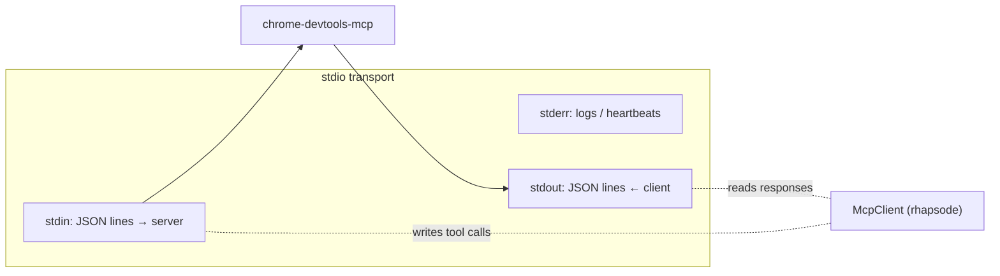
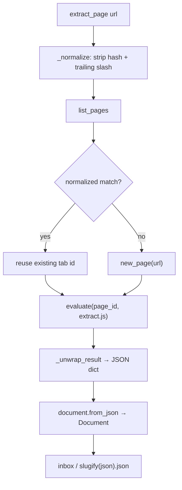

# MCP Integration

Rhapsode uses two separate MCP components:

1. **Chrome DevTools MCP Client** (`mcp.py` / `McpClient`) — reads web-page content from Chrome via the `chrome-devtools-mcp` stdio process. Used by the `extract_page` pipeline.
2. **Rhapsode MCP Server** (`agent.py` / `serve()`) — exposes tools that let AI agents read and drive the live operator booth over stdio.

---

## Chrome DevTools MCP Client

### Overview

The MCP client (`McpClient` in `mcp.py`) orchestrates page extraction: spawn the chrome-devtools-mcp server, list open tabs, navigate or reuse tabs, and evaluate `extract.js` to convert the DOM into a JSON document.

```mermaid
sequenceDiagram
    alias RHAPSODE = extract_page()<br/>(extractor.py)
    alias MCP_CLI = chrome-devtools-mcp<br/>(npx or path)
    alias CHROME = Chrome / Chromium

    RHAPSODE->>MCP_CLI: spawn stdio process (McpClient.__aenter__)
    MCP_CLI->>CHROME: connect to DevTools (autoConnect)

    Note over RHAPSODE,CHROME: MCP stdio handshake

    RHAPSODE->>MCP_CLI: initialize()
    MCP_CLI-->>RHAPSODE: protocol version

    RHAPSODE->>MCP_CLI: list_pages()
    MCP_CLI->>CHROME: CDP Target.getTargets
    CHROME-->>MCP_CLI: page list (plain text)
    MCP_CLI-->>RHAPSODE: response text → _parse_list_pages

    alt tab exists for URL
        RHAPSODE->>MCP_CLI: reuse existing tab
    else new tab
        RHAPSODE->>MCP_CLI: new_page(url)
        MCP_CLI->>CHROME: CDP Target.createTarget
        CHROME-->>MCP_CLI: pageId
        MCP_CLI-->>RHAPSODE: pageId
    end

    RHAPSODE->>MCP_CLI: evaluate(page_id, extract.js)
    MCP_CLI->>CHROME: CDP Runtime.evaluate
    CHROME-->>MCP_CLI: DOM → JSON document
    MCP_CLI-->>RHAPSODE: JSON payload

    RHAPSODE->>RHAPSODE: validate → save to inbox
```

### Server Invocation

The MCP server is spawned by `McpClient.__aenter__()`. The command is controlled by `RHAPSODE_CHROME_MCP`:

| Value | Example |
|-------|---------|
| Default | `npx -y chrome-devtools-mcp@latest --autoConnect` |
| Custom binary | `/opt/mcp-server --autoConnect` |
| Bare path | `npx chrome-devtools-mcp` (launches fresh Chrome) |

`--autoConnect` attaches to a **running** Chrome instance. Without it the server tries to launch Chrome — which fails inside WSL (no display server).

### Transport



### API Methods

All methods live in `McpClient` under `async with` context management.

#### `async with McpClient() as client: …`

Initializes the stdio transport and runs the MCP `initialize` handshake. `__aexit__` tears down the session and stdio pipes.

#### `client.list_pages()` → `List[Dict]`

Return open Chrome tabs.

Raw response (plain text from chrome-devtools-mcp):
```
## Pages
1: https://example.com/foo [selected]
2: https://example.com/bar
```

Parsed into:
```json
[
  {"id": 1, "url": "https://example.com/foo"},
  {"id": 2, "url": "https://example.com/bar"}
]
```

`_parse_list_pages()` uses regex `^(\d+):\s+(.+)$` (multiline) and strips `[selected]` suffix in Python.

#### `client.new_page(url)` → `int`

Open a new tab and return its page id.

Raw response: `"Page 14 is opened"` → `14`. Calls the tool **`new_page`** with `url` and `background=True`.

#### `client.navigate(page_id, url)`

Navigate an existing tab to a new URL. Calls the tool **`navigate_page`** with `pageId`, `type="url"`, and `url`.

#### `client.evaluate(page_id, js_function, wait_stable=True)` → `Any`

Evaluate a JavaScript function expression in a tab's page context and return the result.

Python method:
```python
result = await client.evaluate(14, "() => { return document.title; }", wait_stable=True)
```

This calls the chrome-devtools-mcp tool **`evaluate_script`** with arguments `pageId`, `function`, and `waitForStableDom`.

### Tab Reuse Logic

`extractor._find_or_create_page()` avoids spawning duplicate tabs for the same URL:



Normalization example:

| Input | Normalized |
|-------|-----------|
| `https://example.com/page/#section` | `https://example.com/page` |
| `https://example.com/page/` | `https://example.com/page` |
| `https://example.com/page?q=1` | `https://example.com/page?q=1` |

### Extractor JavaScript

`extract.js` is an arrow function executed verbatim inside the target page. It is **read-only** — never mutates the DOM.

### Result Unwrapping

`extractor._unwrap_result()` handles the many ways chrome-devtools-mcp wraps a JSON response:

| Form | Example |
|------|---------|
| Plain dict | Already parsed by MCP layer |
| JSON string | `"{ \"title\": … }"` |
| Text-wrapped JSON | `"Result: { \"title\": … } ← end"` |
| Double-encoded | `"{\\\"title\\\": …}"` → inner string → parsed |

---

## Rhapsode MCP Server

### Overview

`agent.serve()` runs a separate MCP server that lets AI agents read and drive the live Rhapsode booth. It speaks MCP on stdin and forwards tool calls to the operator HTTP server (`desk.py`) via the `Booth` client class.

```mermaid
sequenceDiagram
    alias AGENT = AI agent / LLM
    alias RS = agent.serve()<br/>(Rhapsode MCP server)
    alias B = Booth HTTP client
    alias D = desk.py<br/>(operator desk)

    AGENT->>RS: stdio: initialize()
    RS-->>AGENT: capabilities + tools list

    AGENT->>RS: call_tool("status", {})
    RS->>B: status() → GET /session
    B->>D: GET /session
    D-->>B: session JSON
    B-->>RS: agent_view(session)
    RS-->>AGENT: simplified view

    AGENT->>RS: call_tool("play", {})
    RS->>B: command({type: transport, action: play})
    B->>D: POST /control
    D-->>B: 200 OK
    RS-->>AGENT: result
```

### Tools

The MCP server exposes 13 tools. All tool calls are forwarded to the operator desk over HTTP.

#### `status`

**Description**: What the booth is doing now: page, spoken line, transport, speed, voice, and Chrome.

**Parameters**: none.

**Returns**: `agent_view(session)` — simplified session dict:
```json
{
  "transport": "playing",
  "speed": 1.2,
  "voice": "af_heart",
  "playhead": 45.3,
  "title": "Chapter Title",
  "page": "https://example.com/article",
  "page_url": "https://example.com/article",
  "lines": 200,
  "progress": { "done": 50, "rendering": 1, "pending": 149 },
  "line": { "index": 50, "kind": "p", "status": "rendering", "text": "…" },
  "nearby": [ { "index": 49, "kind": "p", "current": false, … } ],
  "chrome_connected": true,
  "chrome_active": true
}
```

Routes to: `GET /session` → `agent.agent_view()`.

#### `play`

**Description**: Start playback in the open operator page.

**Parameters**: none.

Routes to: `POST /control` with `{"type": "transport", "action": "play"}`.

#### `pause`

**Description**: Pause playback in the open operator page.

**Parameters**: none.

Routes to: `POST /control` with `{"type": "transport", "action": "pause"}`.

#### `speed`

**Description**: Set the playback speed. 0.5 to 2.0.

**Parameters**:
| Name | Type | Required | Default | Constraints |
|------|------|----------|---------|-------------|
| `value` | float | yes | — | 0.5 ≤ value ≤ 2.0 |

Routes to: `POST /control` with `{"type": "speed", "value": N}`.

#### `seek`

**Description**: Jump playback to a time in seconds on the 1.0× timeline.

**Parameters**:
| Name | Type | Required | Default | Constraints |
|------|------|----------|---------|-------------|
| `seconds` | float | yes | — | seconds ≥ 0 |

Routes to: `POST /control` with `{"type": "seek", "seconds": N}`.

#### `skip`

**Description**: Skip forward or back by seconds from the current playhead. Negative moves back. Raises `RuntimeError` if the booth has not yet reported a playhead.

**Parameters**:
| Name | Type | Required | Default | Constraints |
|------|------|----------|---------|-------------|
| `seconds` | float | no | 15 | — |

**Behavior**: Reads current playhead from `status()`, adds `seconds`, clamps to ≥ 0, then calls `seek`.

Routes to: `POST /control` with `{"type": "seek", "seconds": max(playhead + seconds, 0)}`.

#### `voice`

**Description**: Switch the Kokoro voice from the given line onward. Use a voice id such as `af_heart`. When `line` is not provided, resolves to the current audio line from `status()`.

**Parameters**:
| Name | Type | Required | Default | Constraints |
|------|------|----------|---------|-------------|
| `name` | str | yes | — | must be in `ENGLISH_VOICES` (28 voices) |
| `line` | int | no | None | line ≥ 0; when None, auto-resolves to current line from `status()` |

Routes to: `POST /control` with `{"type": "voice", "value": name, "line": N}`.

#### `voices`

**Description**: List the Kokoro voices the booth can speak with.

**Parameters**: none.

**Returns**: `{"voices": [...]}`. Each voice has `id`, `label`, `accent`, and `gender`.

Routes to: `GET /voices`.


#### `lines`

**Description**: Return a slice of the script lines.

**Parameters**:
| Name | Type | Required | Default | Constraints |
|------|------|----------|---------|-------------|
| `start` | int | no | 0 | ≥ 0 |
| `count` | int | no | 20 | ≥ 1 |

**Returns**: `{"lines": [...]}`. Each line has `index`, `kind`, `status`, `text`, `start`, and `end`.

Routes to: `GET /session` → `Booth.lines()`.

#### `seek_line`

**Description**: Seek to the start of a specific script line by index.

**Parameters**:
| Name | Type | Required | Default | Constraints |
|------|------|----------|---------|-------------|
| `index` | int | yes | — | ≥ 0, line must have audio (start time) |

**Behavior**: Looks up the line's start time and seeks to it. An index outside the script, or a line with no audio yet, is a tool error that includes the reason.

Routes to: `GET /session` → `POST /control` (seek).

#### `tabs`

**Description**: List open Chrome tabs.

**Parameters**: none.

**Returns**: `{"tabs": [...]}`. Each tab has `id` and `url`, and `title` when Chrome has one.

Routes to: `GET /tabs` → `Booth.tabs()`.

#### `open_tab`

**Description**: Open and read a Chrome page. Reuses an existing tab for the same URL.

**Parameters**:
| Name | Type | Required | Default | Constraints |
|------|------|----------|---------|-------------|
| `url` | str | yes | — | must start with `http` |

Routes to: `POST /tab`. A non-http URL is rejected before the request. A refusal comes back as a tool error that includes the reason.

#### `export`

**Description**: Export spoken lines from `start` to `end` as a WAV file.

**Parameters**:
| Name | Type | Required | Default | Constraints |
|------|------|----------|---------|-------------|
| `start` | int | no | 0 | ≥ 0 |
| `end` | int | no | 0 | inclusive line index; `0` exports line 0 only |
| `name` | str | no | `"rhapsode.wav"` | file name, saved under `XDG_CACHE_HOME/rhapsode/export/` |

**Returns**: `{path, bytes, included, requested, partial}`.

Routes to: `GET /export.wav?from=<start>&to=<end>&name=<name>`. A range with no audio is a tool error that includes the reason.

### Booth HTTP Client

`agent.Booth(base="http://127.0.0.1:8765")` is the HTTP client that the MCP server uses to talk to the operator desk.

| Method | HTTP equivalent |
|--------|----------------|
| `status()` | `GET /session` → `agent_view(response)` |
| `command(msg)` | `POST /control` with `msg` JSON |
| `voices()` | `GET /voices` |
| `lines(start, count)` | `GET /session` → slice of lines |
| `seek_line(index)` | lookup line → `POST /control` (seek) |
| `tabs()` | `GET /tabs` |
| `open_tab(url)` | `POST /tab` |
| `export(start, end, name)` | `GET /export.wav` → writes WAV under the cache `export` directory |

### `serve(base)` Parameters

| Name | Type | Default | Description |
|------|------|---------|-------------|
| `base` | str | `"http://127.0.0.1:8765"` | Operator desk URL |

### Error Modes

| Cause | Symptom | Recovery |
|-------|---------|----------|
| Booth not running | `RuntimeError: The booth is not running.` | Start with `rhapsode live DOCUMENT.json` |
| Bad command | `RuntimeError` from desk error response | Check command fields |
| Invalid speed/voice | `ValueError` from `interpret_command` | Use valid range/voice id |

---

## WSL Considerations

Inside WSL:

- **No GUI** → Chrome cannot be launched from inside WSL
- **Network isolation** → `::1:9222` bound on the Windows host is unreachable from WSL2
- **Solution**: Launch Chrome on Windows with `--remote-debugging-port=9222`, then use an MCP server that can bridge to it (e.g., expose the port via Windows firewall and connect via the WSL host IP)

When the live path is not available, `document.load()` can still parse Markdown or plain-text files end-to-end.
